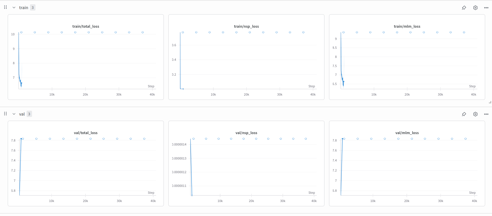

# Urdu-BERT Pretraining (PyTorch)

I implemented **BERT model from scratch with Pytorch** on **Urdu news text**. It uses **Masked Language Modeling (MLM)** and **Next Sentence Prediction (NSP)** tasks, just like the original BERT model.

---

## ✅ Features

- Trained on [Urdu-1M-news-text](https://huggingface.co/datasets/El-chapoo/Urdu-1M-news-text)
- Custom WordPiece tokenizer
- Multi-head attention & transformer encoder blocks
- NSP and MLM heads
- Uses PyTorch and HuggingFace Tokenizers
- Training tracked with Weights & Biases (WandB)

---
## ⚙️ Training Setup

| Setting            | Value       |
|--------------------|-------------|
| Epochs             | 20          |
| Batch Size         | 64          |
| Sequence Length    | 64 tokens   |
| Embedding Size     | 128         |
| Encoder Layers     | 2           |
| Attention Heads    | 2           |
| Max LR             | 2.5e-5      |
| Warmup Steps       | 1000        |
| Optimizer          | Adam        |

---
## 📊 Training Loss (WandB)

Below is an example of the loss curve during training:



> This shows MLM loss, NSP loss, and total loss reducing over time.

## 🔗 Model on Hugging Face

You can find the model here:  
👉 [Bert-Urdu](https://huggingface.co/mahwizzzz/Urdu-Bert)  

---
## 🛠 How to Run

### 1. Install requirements

```bash
pip install torch transformers datasets wandb tokenizers torchinfo
```
### 2. (Optional) Train tokenizer

Uncomment the tokenizer block in train.py to train your own tokenizer.

### 3. Run training

```bash
python train.py
```

Checkpoints will be saved in the checkpoints/ folder.

## 📁 Folders

- datasets/ – Preprocessed Urdu text
- bert-ur-1/ – Custom tokenizer files (vocab.txt, etc.)
- checkpoints/ – Model weights saved per epoch

## 📌 Notes

- NSP uses random sentence pairs for false samples
- Positional embeddings are created using sin/cos
- Custom learning rate scheduler with warm-up
- Model is built completely from scratch (no pretrained weights)

## 📚 References

- [BERT from Scratch (Medium)](https://medium.com/data-and-beyond/complete-guide-to-building-bert-model-from-sratch-3e6562228891)
- [PyTorch BERT Tutorial](https://ai.plainenglish.io/bert-pytorch-implementation-prepare-dataset-part-1-efd259113e5a)
