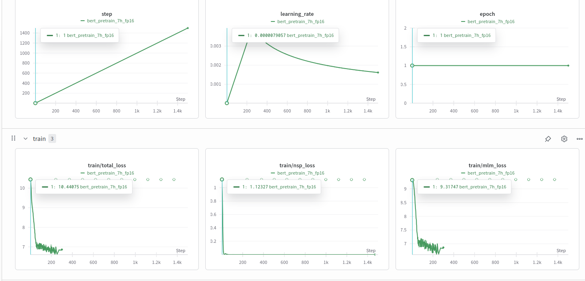

# Urdu BERT — PyTorch Implementation

i implemented BERT **from-scratch pretraining pipeline on the Urdu language**, in **pure PyTorch**. It is designed for full control over data preprocessing, tokenization, and model internals without relying on high level abstractions like HuggingFace `Trainer`.

---

## Novelty & Importance

- **Low-Resource Language Modeling**: Urdu remains underrepresented in large scale NLP models. This work addresses the gap by training a domain agnostic BERT encoder tailored to Urdu morphology and syntax.
- **Tokenizer Adaptation**: I build a WordPiece tokenizer trained on raw Urdu corpora, optimized for handling compound words, affixes, and contextual ambiguity specific to Urdu.
- **Lightweight Architecture**: The model (~2.8M parameters) allows pretraining in constrained compute environments while preserving core Transformer properties.
- **Research-Friendly**: Full transparency in tokenization, data flow, and optimization pipeline suitable for researchers exploring cross lingual transfer, token efficiency, or domain adaptation in Urdu NLP.

---

---

## Model Details

| Component           | Value           |
|---------------------|------------------|
| Model               | BERT (Encoder-only) |
| Layers              | 6                |
| Hidden Size         | 256              |
| Attention Heads     | 8                |
| Max Position Emb.   | 512              |
| Total Params        | 2,768,658        |
| Multiply-Adds       | ~379.7M          |
| Mixed Precision     | ✅ (torch.amp)    |

---
## Memory & Efficiency

| Metric              | Value       |
|---------------------|-------------|
| Input Size          | 0.20 MB     |
| Forward/Backward    | 865.08 MB   |
| Params Size         | 11.07 MB    |
| Total Memory Usage  | ~876 MB     |

---

## Logging

- Integrated with **Weights & Biases** (`wandb`) for real time tracking.
- Automatically logs loss, learning rate, memory usage, and token accuracy.

  
---

## Known Issues

- NSP objective is **not included** (MLM-only).
- Replace deprecated `torch.cuda.amp.GradScaler()` with `torch.amp.GradScaler('cuda')` in newer PyTorch versions.

---

## License

MIT License

---

## Citation

If you use this implementation or its results in your research, please cite this repository and credit the author.
